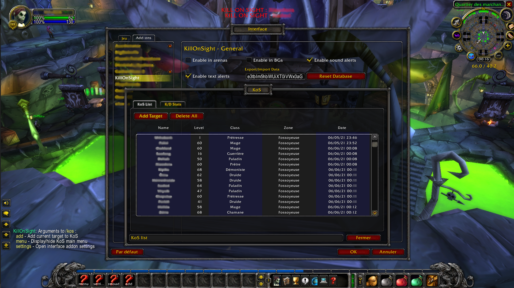

# KillOnSight [UNDER DEVELOPMENT]

## Description
This is a World Of Warcraft addon which allows to create a Kill On Sight list of enemy players and alert you whenever you target or mouseover them, it also scan for currently visible nameplates on your UI and trigger an alert.
The addon also tracks kills and deaths done to/from a unit.

## Requirements
KillOnSight is currently developed using **Classic Burning Cruisade** interface (version 20501). It may works on Retail but it hasn't been tested yet

## Installation
- Download zip folder from [here](https://github.com/eliasbokreta/KillOnSight/archive/refs/heads/main.zip) and extract into your **AddOns** folder, generally located under  `Battle.net\World Of Warcraft\_classic_\Interface` folder.
You can also `git clone https://github.com/eliasbokreta/KillOnSight.git` and move the folder into your **AddOns** folder.
- Start the game
- Enable the *KillOnSight* addon from your addon WoW menu

## Usage
### Commands :
You can access the command line with the following chat slash commands
- `/k <option>`
- `/kos <option>`
- `/killonsight <option>`

### Options :
- `/kos add` : Add current target to KoS
- `/kos delete <playerName>` : Remove a player from the list
- `/kos menu` : Display/hide KoS main menu
- `/kos settings` : Open interface addon settings

## Screenshots

## Features
### Kill On Sight
*Handles Kill on Sight core features for alerting and tracking*
- **Add a player to your kill on sight list** :
    - *a target* - **From the chat command or the main window (under 'KoS List' tab)**
- **Remove a player from your kill on sight list** :
    - *a target* - **From the main window (under 'KoS List' tab)**
    - *a player by his name* - **From the chat command**
    - *a player selected in the list* - **From the main window (under 'KoS List' tab)**
- **Filter players for display** :
    - *by name* - **From the main window (under 'KoS List' tab)**
- **Handling KoS list** :
    - *import (override or append) a list* - **From the addon settings**
    - *export a list* - **From the addon settings**
    - *reset the list* - **From the main window (under 'KoS List' tab) or the addon settings**
- **Customize alerts** :
    - *enable/disable text alerts* - **From the addon settings**
    - *enable/disable sound alerts* - **From the addon settings**
    - *enable/disable alerts in BGs* - **From the addon settings**
    - *enable/disable alerts in arena* - **From the addon settings**
    - *customize alerts occurence (in seconds)* - **From the addon settings**
    - *choose alerts from specific events (on target, mouseover or namplate visible)* - **From the addon settings**
### Kills history
*Automatically tracks kill and deaths, and get stats for specific players*
- *Add kills/death to the list* - **Automatically done when a kill/death event is registered**
- *Reset the list* - **From the main window (under 'K/D History' tab)**

## To do
- <s>Implement a single player deletion for the KoS list</s>
- <s>Implement an update on last seen position for KoS list</s>
- <s>Implement kills/dead stats for the KoS list</s>
- <s>Separate main window with tabs :</s>
    - <s>KoS list tab</s>
    - <s>Kill/dead history tab, with possibility to add a previous enemy to the KoS list</s>
- <s>Implement a timer for already shown alerts, avoiding alert spaming when changing target/mouseover</s>
- Implement a feature to add player from kill/dead stats tab to the KoS
- Fix > 10 lvls info from the KoS tab
- Add notes to a KoS player
- Implement a silent mode with only chat console messages
- Add guild and realm from KoS and kill/death history tabs
- Enable possibility to KoS a specific guild for alert whenever a member is found

## Donate
### Paypal :

